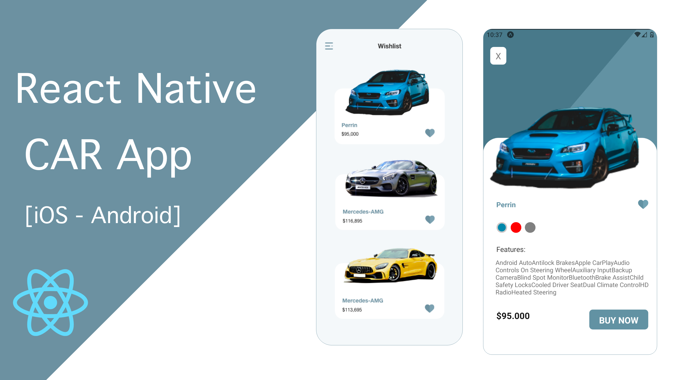

# 🛸 Car App With ReactNative - Expo Go

> ⚠️ [Please be sure your environment is set up correctly for React Native Expo.](https://reactnative.dev/docs/environment-setup)

## ⭐ Features

- [React Native Web](https://necolas.github.io/react-native-web/)
- [TypeScript](https://www.typescriptlang.org/)
- [React Navigation](https://reactnavigation.org/)
- [react-native-svg-transformer](https://yarnpkg.com/package/react-native-svg-transformer)
- [react-native-svg](https://yarnpkg.com/package/react-native-svg)

## Running the app

### Native

1. Start Metro Bundler: `yarn start`
2. Start the Android app: `yarn android`
3. Start the iOS app: `yarn ios` (make sure you have installed pods first! `yarn ios:pods` if needed)

## Development Tools

1. Check your code style with `yarn lint:all` (runs eslint, prettier, and tsc)
1. Check your code correctness with `yarn test:all` (runs jest)

## Youtube Speed code

## [Car App - Speed Code on YouTube](https://youtu.be/w1nzKJNcv_s)

